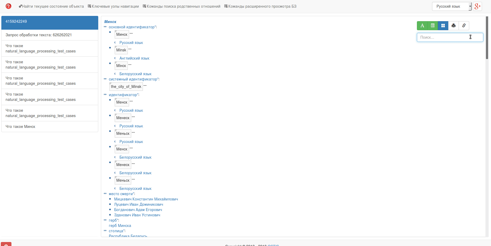

# Ostis natural language processing module

Модуль обработки естественно-языковых текстов предназначен для обработки текста на естественном языке и трансляции его в модель представления знаний OSTIS-систем

## Установка

Чтобы становить модуль, достаточно склонировать его в корень вашего проекта, перейти в папку модуля и выполнить скрипт `./install_component.sh`. Скрипт определит нужные зависимости и установит исходные коды в клиентской части системы (`sc-web`) и базе знаний (`kb`). После выполнения скрипта, модуль обработки текста готов к работе. Если вы внесли изменения в модуль, или обновили его исходные коды из репозитория

## Работа с модулем

Модуль представляет из себя ostis-агента, который работает по такому же принципу как и все другие агенты OSTIS. Входным параметром агента является текстовый узел с текстом на естественном языке. На выходе получается конструкция, определяющая последовательность слов в предложении и их начальную форму.

## Пример работы

